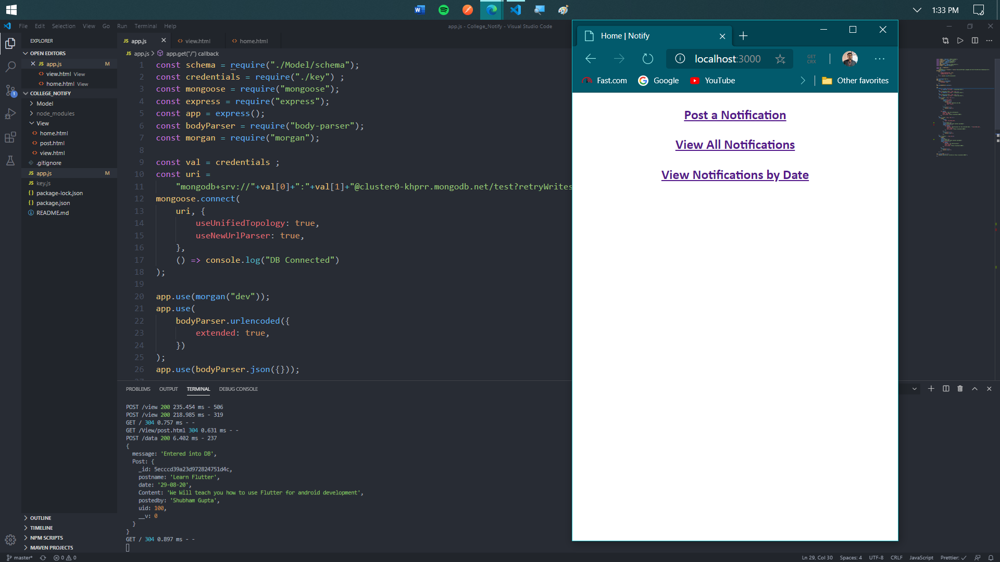
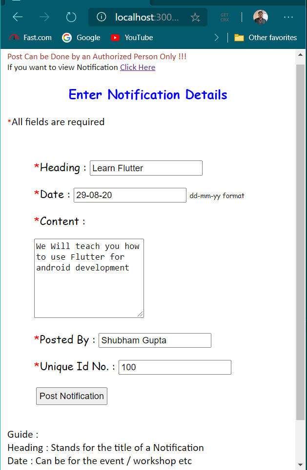
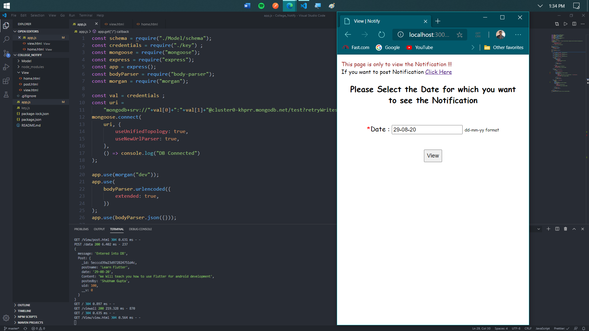
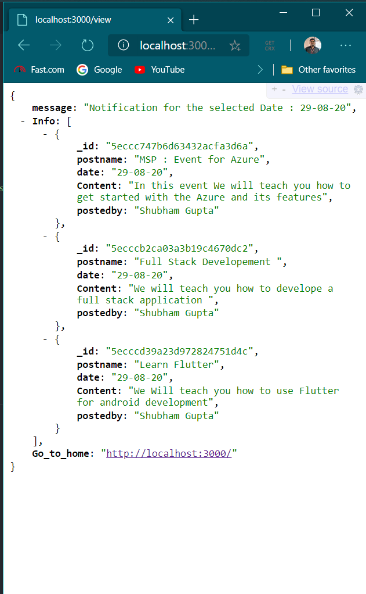

# Notify
A Node Js App for Managing all Notifications by Organizations

## Why This PWA
<p> This PWA can be usefull with for Organization / College / School etc to manage Notification to there Employee / Students </p>
<p> This will help them to pass the notification easily to everyone without Delay</p>

## Tech Stack Used
<ul>
  <li> HTML , CSS , JS </li>
  <li> Node js , Expres </li>
  <li> MongoDB </li>
</ul>

## Result
<ul>
  <li> Home </li>
    
  <li> Filling Notification Details </li>
    
  <li> All Notification </li>
    
  <li> Notification By Date </li>
    
  <li> Notification By Date Result </li>
    
</ul>

## How to Use
<p>
  
1) : first of All```npm install```
</p>
<p>2) : Create an account on MongDb Atlas and make a project , in that make a cluster </p>
<p>3) : Get the username and password and create a file called "key.js" in root directory with the follwoing content 
  
```
  const values = ()=>{
    const user_name = "<username>" ;
    const password = "<password>" ;
    return [user_name,password ]  ;
}
module.exports = values() ;
````
</p>
<p>4) :That's It 
  
```npm start```
</p>
